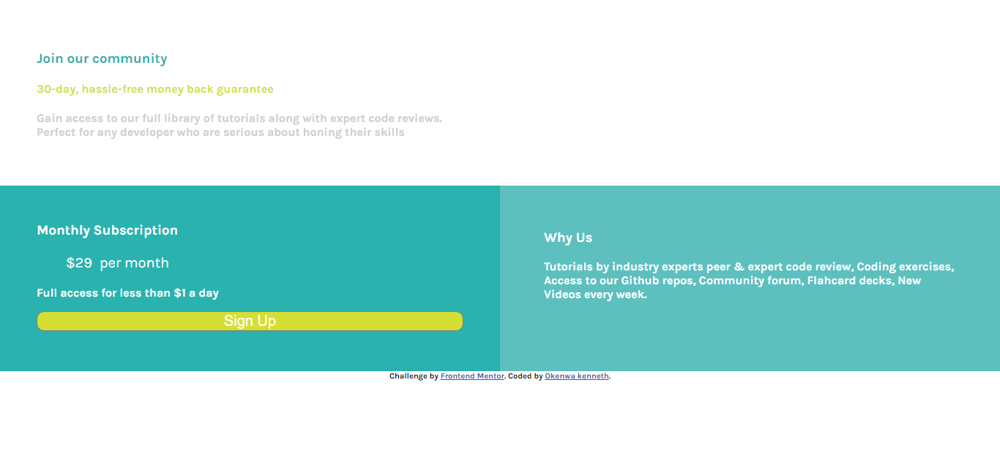

# Frontend Mentor - Single price grid component solution

This is a solution to the [Single price grid component challenge on Frontend Mentor](https://www.frontendmentor.io/challenges/single-price-grid-component-5ce41129d0ff452fec5abbbc). Frontend Mentor challenges help you improve your coding skills by building realistic projects. 

## Table of contents

- [Frontend Mentor - Single price grid component solution](#frontend-mentor---single-price-grid-component-solution)
  - [Table of contents](#table-of-contents)
  - [Overview](#overview)
    - [The challenge](#the-challenge)
    - [Screenshot](#screenshot)
    - [Links](#links)
  - [My process](#my-process)
    - [Built with](#built-with)
    - [What I learned](#what-i-learned)
    - [Useful resources](#useful-resources)
  - [Author](#author)


## Overview


### The challenge

Users should be able to:

- View the optimal layout for the component depending on their device's screen size
- See a hover state on desktop for the Sign Up call-to-action

### Screenshot




### Links

- Solution URL: [Solution submitted](https://www.frontendmentor.io/solutions/html-css-using-css-grid-B5yWBG5M9)
- Live Site URL: [Fc-single webpage](https://fcsinglewebpage.netlify.app/)

## My process

### Built with

- Semantic HTML5 markup
- Flexbox
- CSS Grid


### What I learned

I learnt how to Structure a project, How to do a research before starting a project.

In the process of trying to implement CSS grid, I improved my knowledge of CSS grid and Css in general.

<!-- Use this section to recap over some of your major learnings while working through this project. Writing these out and providing code samples of areas you want to highlight is a great way to reinforce your own knowledge.

To see how you can add code snippets, see below:

```html
<h1>Some HTML code I'm proud of</h1>
```
```css
.proud-of-this-css {
  color: papayawhip;
}
```
```js
const proudOfThisFunc = () => {
  console.log('🎉')
}
```

If you want more help with writing markdown, we'd recommend checking out [The Markdown Guide](https://www.markdownguide.org/) to learn more. -->

<!-- 
### Continued development

Use this section to outline areas that you want to continue focusing on in future projects. These could be concepts you're still not completely comfortable with or techniques you found useful that you want to refine and perfect.

**Note: Delete this note and the content within this section and replace with your own plans for continued development.** -->

### Useful resources

- [Andrew Bergeron's codepen](https://codepen.io/visualrhythm/pen/OqWozw) - This helped me understand CSS grid
- [Example resource 2](https://css-tricks.com/snippets/css/complete-guide-grid/#:~:text=CSS%20Grid%20Layout%20aka%20%E2%80%9CGrid,very%20good%20job%20of%20it.) - This is an amazing article which helped me finally understand CSS grid. I'd recommend it to anyone still learning this concept.


## Author

- Website - [Anekenonso's blog](https://anekenonso.com/)
- Frontend Mentor - [@Anekenonso](https://www.frontendmentor.io/profile/Anekenonso)
- Twitter - [@anekenonso1](https://www.twitter.com/anekenonso1) I will love to hear from you.


